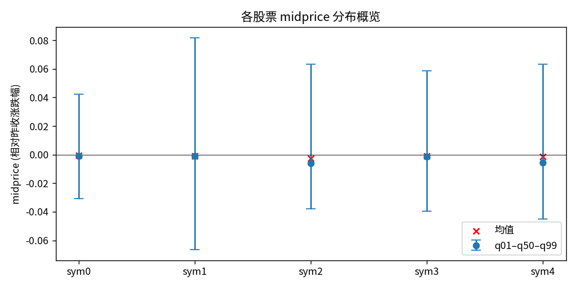
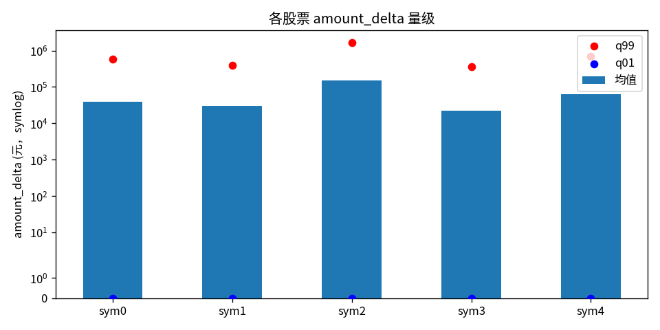
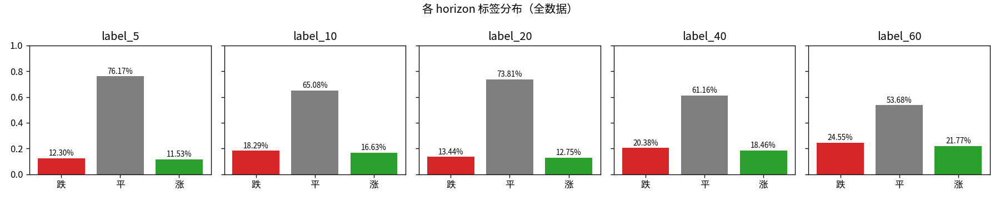
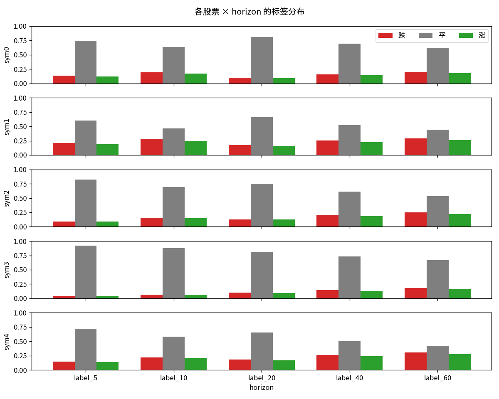
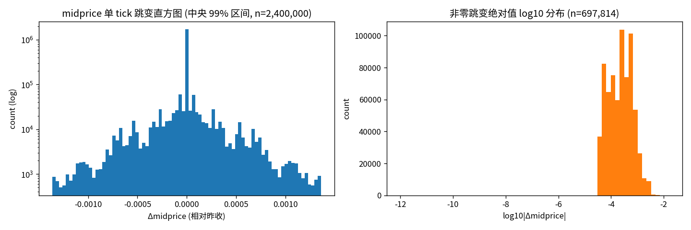
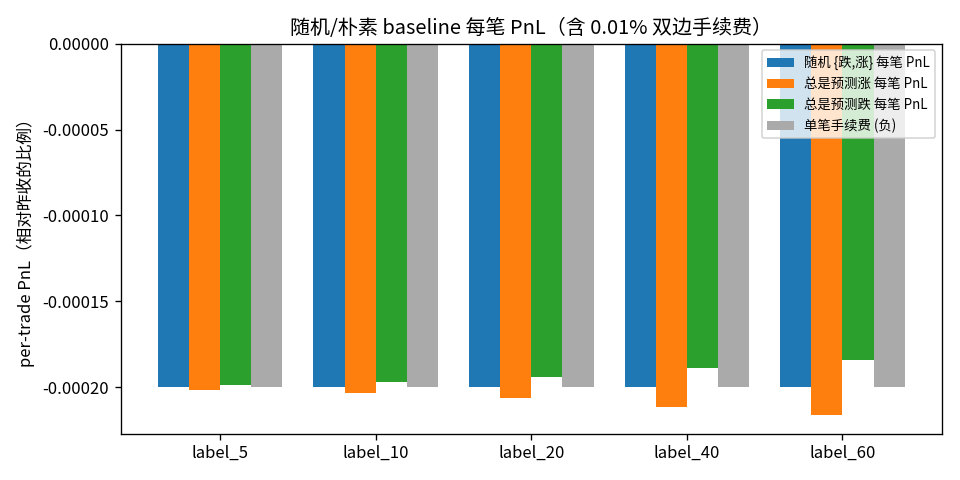

# 良文杯数据 EDA 报告

_生成时间: 2026-05-06T00:32:46_

## 1. 数据完整性

- 文件数：发现 **1200** / 期望 **1200**
  - ✅ 无缺失
- 总行数：2,401,200（期望 2,401,200）
  - ✅ 所有文件均为 2001 行
- NaN 异常文件：**8** 个 / 1200

  | (sym, date, session) | total NaN | 受影响列数 | 单列最多 NaN | 仅 ask 侧? |
  |---|---|---|---|---|
  | (1, 42, am) | 484 | 62 | 11 | ✅ |
  | (1, 74, pm) | 6,337 | 62 | 238 | ✅ |
  | (1, 75, am) | 1,206 | 49 | 38 | ✅ |
  | (1, 75, pm) | 76,279 | 62 | 1501 | ✅ |
  | (1, 91, pm) | 81,296 | 62 | 1318 | ✅ |
  | (3, 16, am) | 85 | 13 | 12 | ✅ |
  | (3, 66, pm) | 13,110 | 31 | 938 | ✅ |
  | (3, 67, am) | 203 | 13 | 32 | ✅ |

  > 所有 NaN 都集中在 **ask 侧 LOB 深度**（ask{N}/asize{N}/spread{N}/ask_diff{N}/ask_rate{N}/asize_rate{N}）。bid 侧、midprice、label 全部干净。
  > 出现 NaN 是 A 股**涨停**机制的副作用：限价 = +9.97% 时卖盘几乎被买光，深档位无报价。  最严重的 (1, 91, pm) 有 1308/2001 ≈ 65% tick 处于涨停。
  > **训练对策**：可选 (a) 直接 drop 这 8 个 session（仅 0.67% 数据），或 (b) NaN → 0 + 增加 ask_missing 指示位。
- Inf 异常文件：0 个
- 时间戳异常文件：0 个
- midprice = -1 (会让 PnL 分母为 0) 的文件：0 个
- midprice = NaN 的文件：0 个
  - ✅ midprice 列健康，PnL 分母安全

## 2. midprice 分布（按 sym 聚合）

| sym | min | q01 | q50 | mean | q99 | max | std |
|-----|-----|-----|-----|------|-----|-----|-----|
| 0 | -4.7503% | -3.0730% | -0.1074% | -0.0516% | 4.2213% | 7.4437% | 1.3125% |
| 1 | -9.1082% | -6.6402% | -0.0826% | -0.1107% | 8.1866% | 10.0322% | 2.2752% |
| 2 | -5.7653% | -3.8001% | -0.5830% | -0.2605% | 6.3093% | 8.6094% | 1.8622% |
| 3 | -7.3819% | -3.9785% | -0.1220% | -0.0929% | 5.8473% | 8.8964% | 1.8175% |
| 4 | -6.1584% | -4.5237% | -0.5463% | -0.1554% | 6.3290% | 9.2902% | 2.2801% |

## 3. amount_delta 量级（唯一未归一化字段）

| sym | min | q01 | q50 | mean | q99 | max | std |
|-----|-----|-----|-----|------|-----|-----|-----|
| 0 | 0 | 0 | 1.48e+03 | 3.92e+04 | 5.71e+05 | 1.51e+07 | 1.66e+05 |
| 1 | 0 | 0 | 3.64e+03 | 3.02e+04 | 4e+05 | 1.45e+07 | 1.1e+05 |
| 2 | 0 | 0 | 5.09e+04 | 1.54e+05 | 1.65e+06 | 3.11e+07 | 4.09e+05 |
| 3 | 0 | 0 | 922 | 2.21e+04 | 3.63e+05 | 1.2e+07 | 1.06e+05 |
| 4 | 0 | 0 | 1.68e+04 | 6.33e+04 | 6.92e+05 | 9.9e+06 | 1.58e+05 |

> ⚠️ amount_delta 跨 sym 量级差异巨大，模型用前必须归一化（log1p 或按 sym z-score）。

## 4. 标签分布

### 4.1 总体（不分 sym）

| label | p_down | p_flat | p_up | n |
|-------|--------|--------|------|---|
| label_5 | 12.30% | 76.17% | 11.53% | 2,401,200 |
| label_10 | 18.29% | 65.08% | 16.63% | 2,401,200 |
| label_20 | 13.44% | 73.81% | 12.75% | 2,401,200 |
| label_40 | 20.38% | 61.16% | 18.46% | 2,401,200 |
| label_60 | 24.55% | 53.68% | 21.77% | 2,401,200 |

### 4.2 按 sym × horizon

## 5. midprice 单 tick 跳变

- 全部 1-tick diff 数：2,400,000
- 单 tick midprice 不动比例：**70.92%**（session 平均 70.92%, min 15.25%, max 99.95%）
- |Δmidprice| 分位数：q50=0.00e+00, q90=3.59e-04, q99=1.36e-03, max=1.57e-02

## 6. "瞎猜" 基线 PnL（关键）

- 评分公式：`pnl = [(a-1)·Δmid - 0.0001·|a-1|·((mid_t+1)+(mid_tn+1))] / (mid_t+1)`
- 手续费 0.01% 双边 → 单笔手续费 ≈ 0.0002 / (mid_t+1) ≈ **0.02%**

| horizon | 随机{跌,涨}/每笔 | 总是涨/每笔 | 总是跌/每笔 | 单笔手续费 | n_pairs |
|---------|------------------|--------------|--------------|------------|---------|
| 5 | -0.0200% | -0.0202% | -0.0198% | 0.0200% | 2,395,200 |
| 10 | -0.0200% | -0.0203% | -0.0197% | 0.0200% | 2,389,200 |
| 20 | -0.0200% | -0.0206% | -0.0194% | 0.0200% | 2,377,200 |
| 40 | -0.0200% | -0.0211% | -0.0189% | 0.0200% | 2,353,200 |
| 60 | -0.0200% | -0.0216% | -0.0184% | 0.0200% | 2,329,200 |

**结论**：随机预测{跌,涨} 在所有 horizon 上每笔期望 PnL ≈ -0.02%（手续费），与 horizon 无关。
总是预测涨/跌的 PnL 取决于数据期内 midprice 的整体漂移；如果训练-评测期分布漂移，'always-up' 也可能正——这正是为什么需要按时间划分 train/val/test 而不是随机切。

**模型必须 beat 的下限**：单笔 PnL 至少 > 0（即净收益 > 手续费 0.02%），整体 PnL 才为正。

## 7. horizon 选择建议

| horizon | p_flat | p_非平 (出手机会比例) |
|---------|--------|------------------------|
| label_60 | 53.68% | 46.32% |
| label_40 | 61.16% | 38.84% |
| label_10 | 65.08% | 34.92% |
| label_20 | 73.81% | 26.19% |
| label_5 | 76.17% | 23.83% |

**注意**：α 阈值不同造成的非单调——label_10 的 p_非平 (34.9%) > label_20 (26.2%)，因为 5/10 用 α=0.05%、20/40/60 用 α=0.1%；阈值翻倍时出手机会突然变少，到 40/60 因 horizon 长再回升。
短 horizon（5/10）每笔潜在收益小，手续费占比相对更高 → 需要 precision 更高才划算。
长 horizon（40/60）每笔潜在收益大但回看跨度长，预测难度也高。
**建议**：5 个 horizon 都训一个 head，最后按提交规则取最好的 1 个 horizon 上榜。label_10 和 label_60 是出手机会最多的两档，重点优化。

## 8. 关键提醒（写给后续 worker）

1. midprice 是**相对昨收的涨跌幅**（中心在 0），不是真实价格。计算 PnL 必须用 `midprice + 1`。
2. amount_delta 跨 sym 差好几个量级，**模型前必须归一化**（建议 log1p 后按 sym z-score）。
3. time 字段在每个 session 内连续 3s，无缺失 → 不需要插值。
4. label 已经标注好（无 NaN），无需重新计算；想改 α 阈值的话用 midprice + horizon 自行重标。
5. 5 个 head 同时训练时损失要平衡：因为 p_flat 不同，类权重 / focal loss 应按 horizon 单独调。
6. PnL 评测时空仓的 t（label=1，即平类）应被忽略，但 acc/f1 算指标时要全算 → 训练损失和评测口径不一致。
7. 8 个 NaN 文件全部在 sym=1 / sym=3 的涨停日，仅影响 ask 侧深档；bid 侧和 midprice 干净。训练时建议把 NaN 替换为 0 并增加 `ask_missing` 指示位，避免直接喂 NaN 给模型。
8. 单 tick midprice **70.9% 概率不动**——这是 LOB 数据的常见性质。模型若只学'下一 tick 是否动'会被噪声主导，应直接学 horizon=5/10/20/40/60 ticks 后的方向。
