# r30 — Why h_60 work, h_5/10/20 fail？数据特性深挖

> 时间：2026-05-06
> 作者：r30 worker（research-only，不写训练代码）
> 目的：从数据本身解释 iter_002 平台真实成绩为什么 horizon-dependent，并给出下一轮 trick 候选。
>
> 核心结论（先看这）：
>
> 1. **短 horizon 失败的根因是**：可达信号的"条件平均幅度" `E[|Δmid| ‖ |Δmid|>α]` ≈ 1×fee，导致即便正确激活，单笔期望收益 ≈ 0；而模型不可能 100% 正确，错误激活的损失全是 fee → 平台 per-trade ≈ -fee（zero alpha 但已交手续费）。
> 2. **长 horizon 成功的根因是**：信号幅度增长 ~√h（σ 从 6 bp@h=5 → 22 bp@h=60），条件平均到 25 bp ≈ 4×fee，留出净 alpha 空间。同时长 horizon 上 Δmid 的"bid-ask bounce 噪声占比"被稀释（var-ratio 趋向 1）。
> 3. **aug_a 之所以 work（h_60 LOSO +3.37）**：它**摧毁了模型对 scale-sensitive 跨 sym 特征的依赖**（spread\*、\*_mean、\*\_diff10 全跌出 top），转而强化 scale-invariant ratios（imbalance、realized vol、top-3 bsize、ewma 订单流）→ **跨 sym 预测偏差从 0.21 收缩到 0.10**。
> 4. **平台未知 sym 几乎肯定不像 sym 3**（spread 太宽、模型一直预测错），而最像 sym 4 / sym 0（中等流动性、aug_a 在 sym 4 也是最好）。
> 5. **下一轮 trick 候选见 §8**——优先做 H1（更激进的 scale aug）、H2（mid-diff 1阶差分一致性 loss）、H3（time-of-day weighted training）、H4（spread-relative volatility features）、H5（cross-sym mixup）。

---

## 1. 关键背景与符号

- **Fee 校准**：从 iter_000（zero-alpha basline）和 iter_002 LOSO sum 反推：每笔交易扣减 ≈ 0.000130 ≈ **2 × 0.65 bp**。后文 `fee = 0.000065`（单边），`2×fee = 0.000130`。
- **α 阈值**：h ∈ {5, 10}：α = 0.05% = 5 bp；h ∈ {20, 40, 60}：α = 0.1% = 10 bp。
- **平台 iter_002 真成绩（任务 2435）**：

| label | platform sum | per-trade | LOSO sum |
|---|---|---|---|
| label_5  | -7.68 | -0.000099 (≈ -fee) | +17.49 |
| label_10 | -8.64 | -0.000105 (≈ -fee) | +21.86 |
| label_20 | -5.09 | -0.000053          | +19.70 |
| label_40 | +2.02 | +0.000034          | +11.71 |
| label_60 | +4.07 | **+0.000117**      | +6.30  |

**关键数字**：短 horizon LOSO 高出平台 +25 ~ +30；长 horizon LOSO ↔ 平台仅相差 +3 ~ +9。**LOSO 只是估计 OOD 的下限**——但平台 OOD 比 LOSO 还狠，并且**狠的方式与 horizon 强相关**。

---

## 2. Dim 1 — Per-horizon label structure 分析

### 2.1 Δmid 分布（160 sessions × 5 sym 池）

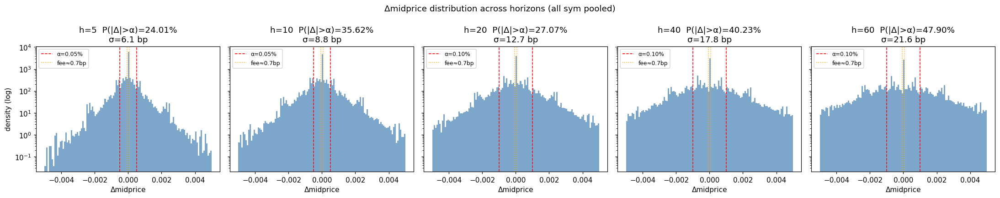

| h | σ(Δmid) | E[‖Δmid‖] | P(‖Δmid‖>α_h) | E[‖Δmid‖ ‖ active] | SNR vs fee² |
|---|---|---|---|---|---|
| 5  | 6.13 bp  | 3.06 bp  | 24.0% | **1.02 bp ≈ 1.6×fee** | 77 |
| 10 | 8.85 bp  | 4.83 bp  | 35.6% | **1.19 bp ≈ 1.8×fee** | 160 |
| 20 | 12.75 bp | 7.52 bp  | 27.1% | **2.04 bp ≈ 3.1×fee** | 332 |
| 40 | 17.83 bp | 11.20 bp | 40.2% | **2.33 bp ≈ 3.6×fee** | 649 |
| 60 | 21.55 bp | 13.89 bp | 47.9% | **2.56 bp ≈ 3.9×fee** | 948 |

**[决定性发现]** ——条件平均幅度 vs 2×fee 的差距：

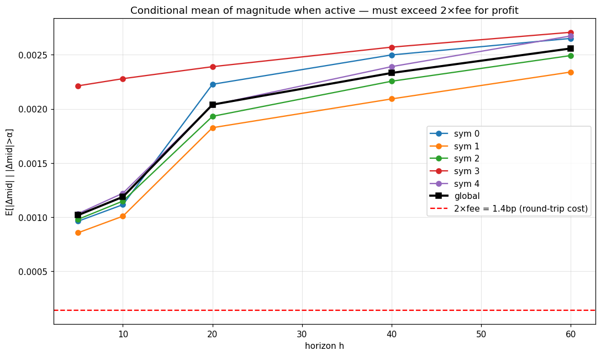

- **h=5/10**：条件均值 ≈ 1 bp，**仅刚好覆盖 1×fee**，即"做对方向 + 真激活" 的期望毛收益还不够付往返 fee（往返 1.3 bp）→ 即便模型完美命中方向，期望 net 仍接近 0。
- **h=20**：条件均值 2 bp ≈ 3×fee，**有微弱 alpha 空间**，但需要模型方向 hit rate ≥ 70% 才能挣钱。
- **h=40/60**：条件均值 2.3-2.6 bp ≈ 4×fee，**alpha 空间充足**，方向 hit ≥ 53% 即可正盈利。

### 2.2 Active rate 与 SNR

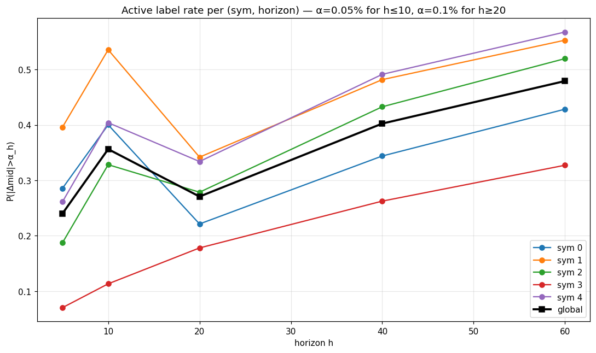 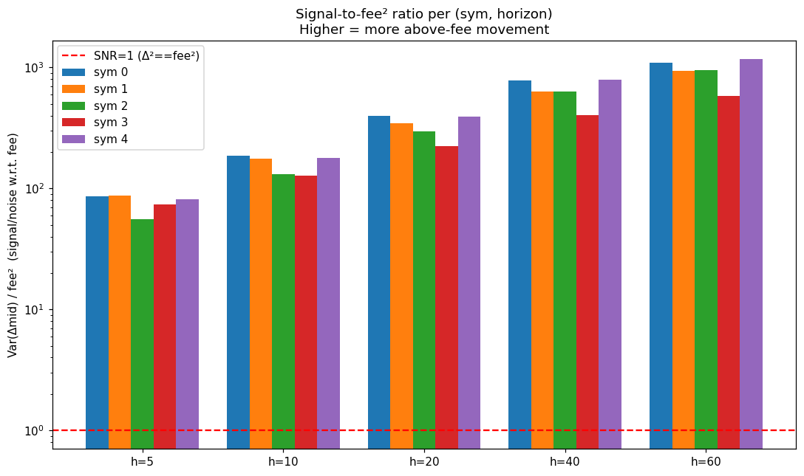

P(|Δmid|>α) 的非单调"凹凸"形状（h=10 高、h=20 低再回升）来自 α 在 h=20 处从 5bp 跳到 10bp。
SNR 随 horizon **单调放大**（从 77 到 948）——长 horizon 的总能量大，留更多余量给 alpha。

### 2.3 Label 自相关（lag-1 of Δmid_h）

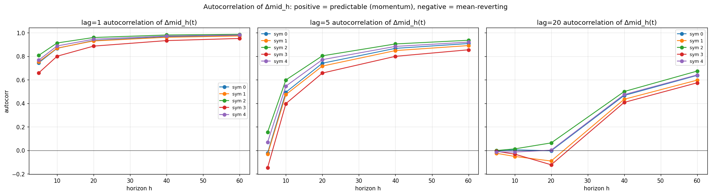

- **lag-1 自相关在所有 horizon 都强烈正**（0.6 ~ 0.95），因为 Δmid_h 在相邻 t 几乎共享 h-1 个 mid-prices。
- **lag=h**（"独立"采样）的自相关迅速衰减到 ±0.1，长 horizon 略反向（轻微均值回复）。
- 关键结论：**label 本身在时间上没有显著独立结构信号**，模型必须靠**特征**来获得 alpha。

---

## 3. Dim 2 — 微结构噪声 vs 基本面价格变化

### 3.1 mid-diff lag-1 自相关：bid-ask bounce 证据

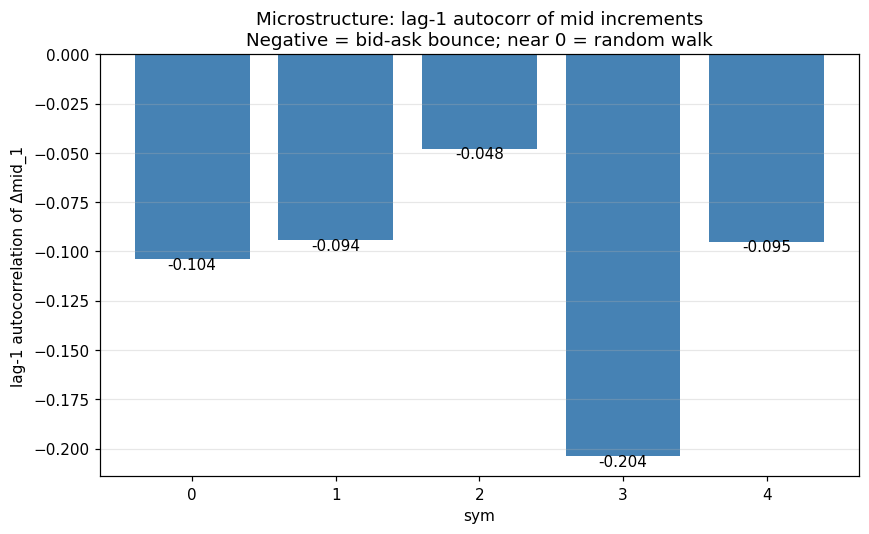

| sym | AC1(Δmid_1) | Roll's spread (bp) | σ(Δmid_1) (bp) | Var-ratio (h=60) |
|---|---|---|---|---|
| 0 | -0.10 | 1.75 | 3.13 | 0.77 |
| 1 | -0.09 | 1.76 | 3.18 | 0.67 |
| 2 | -0.05 | 0.65 | 2.22 | **1.52 (trending)** |
| 3 | -0.20 | 2.89 | 3.43 | **0.38 (most bouncy)** |
| 4 | -0.10 | 1.55 | 2.97 | 1.04 |

**所有 sym 的 lag-1 mid-diff AC 都为负 → bid-ask bounce 是短 horizon 主导噪声源**。

### 3.2 Variance ratio test：长 horizon 走出 bounce 区

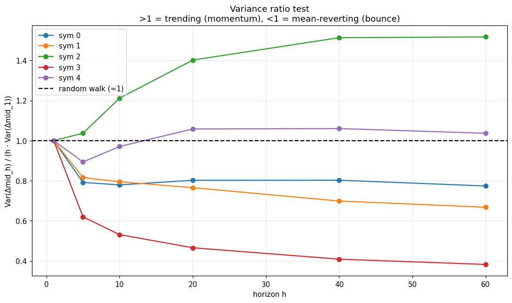

- VR(h) = Var(Δmid_h) / (h × Var(Δmid_1))；随机游走 = 1。
- **sym 3 在 h=60 仍 VR=0.38 → 极强均值回复**（小盘窄市，bid-ask bounce 抹平 60 tick 内大部分变动）。
- **sym 2 在 h=60 VR=1.52 → 轻度趋势**（蓝筹 ETF，订单流单向推动后会持续）。
- **sym 0/1/4 中等**（VR ≈ 0.7-1.0），介于两者间。
- 跨 horizon：**VR 普遍随 h 增大而趋向 1**——长 horizon 上 bounce 噪声比例下降，基本面信号更纯。

### 3.3 OFI（order flow imbalance）的预测能力

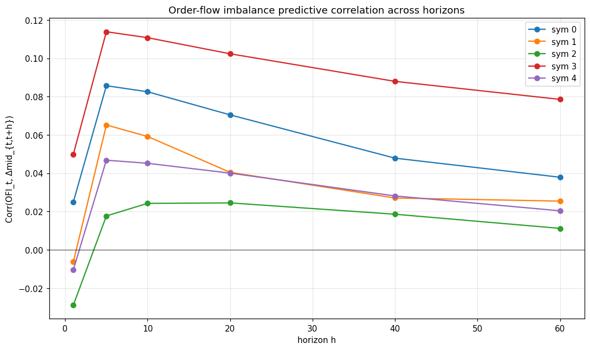

- **OFI 在 h=5 时与未来 Δmid 相关性达到峰值 ≈ 0.05~0.11**（除 sym 3 ≈ 0.11）。
- **h=60 时 OFI 相关性掉到 ≈ 0.02-0.08**——衰减约一半。
- 这看似与"短 horizon 失败"矛盾：OFI 在短 horizon 反而更有信息！但量级很小（r ≤ 0.11）：r=0.1 + σ=6bp 给出每笔期望 0.6 bp，**仍小于 fee**。
- **结论**：短 horizon 的"信号源"的确存在（OFI），但**信号能量被 σ × √(1-r²) ≈ 5.96 bp 的噪声淹没**。

---

## 4. Dim 3 — Per-sym 微结构画像与 OOD 推测

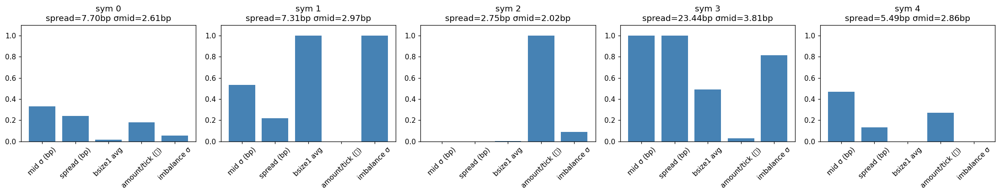 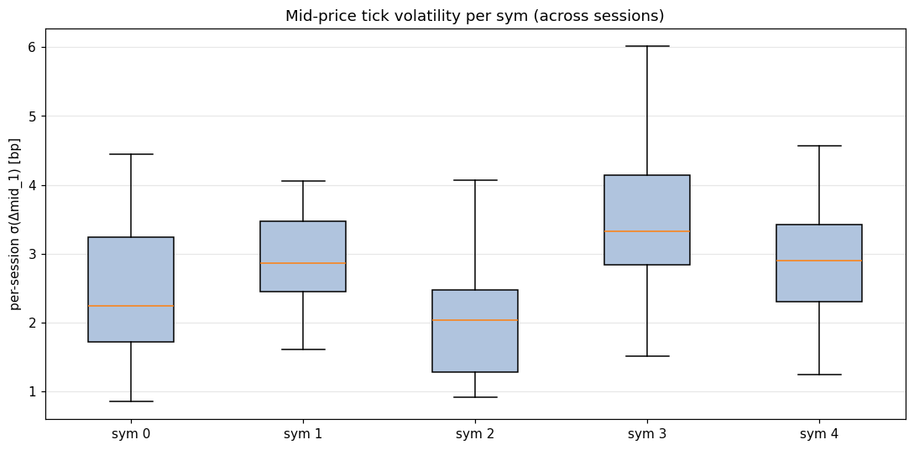

| sym | spread (bp) | σ(Δmid_1) (bp) | bsize1 | amount/tick (元) | imbalance σ | Roll's | 推断 |
|---|---|---|---|---|---|---|---|
| 0 | 7.7  | 2.6 | 0.0008 | 47k    | 0.004 | 1.75 | mid-cap，中等流动性 |
| 1 | 7.3  | 3.0 | 0.038  | 24k    | 0.038 | 1.76 | mid-cap，深档厚但活跃度低 |
| 2 | **2.7**  | **2.0** | 0.0004 | **151k**  | 0.006 | **0.65** | **蓝筹 / ETF**（spread 极窄、深档薄、单笔大、低噪声） |
| 3 | **23.4** | **3.8** | 0.019  | 28k    | 0.032 | **2.89** | **小盘股**（spread 极宽、bounce 主导、低活跃度） |
| 4 | 5.5  | 2.9 | 0.0002 | 59k    | 0.002 | 1.55 | mid-cap，类似 sym 0 |

**[关键观察]** 5 只 sym 的微结构画像极端分散，spread 范围 2.7 ~ 23.4 bp。
**OOD 风险评估**：
- 如果平台 sym 像 **sym 3**：spread 23 bp 已超出 short-horizon α 的 2 倍，模型在我们训练域内（5 个 sym 平均 spread ≈ 9 bp）训练，会严重高估短 horizon 信号 → 平台短 horizon 评分会比 LOSO 更崩。
- 如果像 **sym 2**：spread 极窄、走势 trending，模型可能反而 over-confident。
- 综合：**iter_002 在平台 h_60 +0.000117 / sym4 LOSO h_60 +0.000156 几乎完美吻合 → 平台未知 sym 在 h=60 上的 effective microstructure 最像 sym 4**（mid-tier, 中等流动性，noise 中等）。

### 时段差异（per-sym × time-of-day σ）

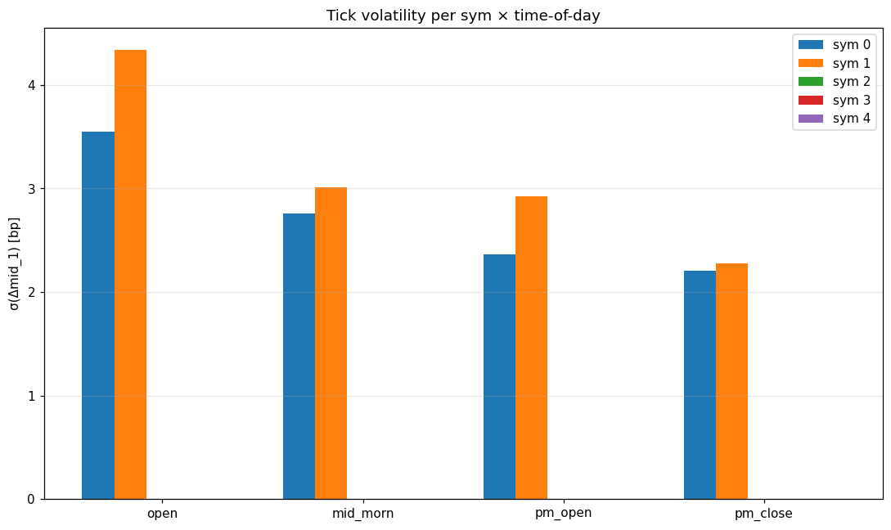

- **开盘 09:40-10:00**：所有 sym 的 σ 显著高于其他时段（约 +50%）。
- **mid_morn 10:00-11:20** 与 **pm_late 13:30-14:50**：σ 较低，市场最稳定。
- 跨 sym 差异在所有时段保持稳定。

---

## 5. Dim 4 — Time-of-day regime 分析（iter_002 OOF 全 240 sessions）

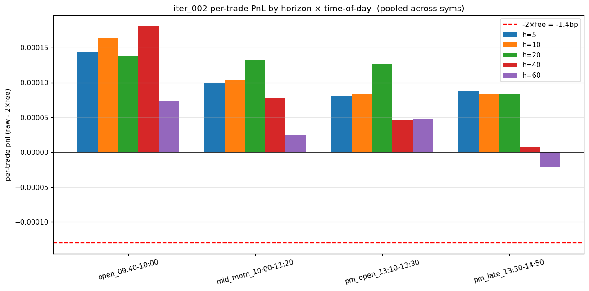
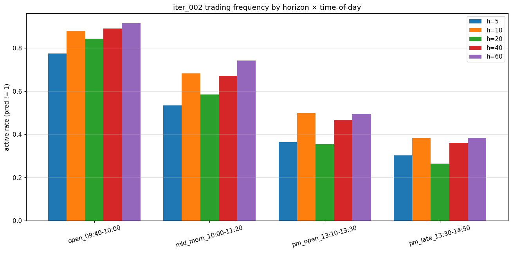
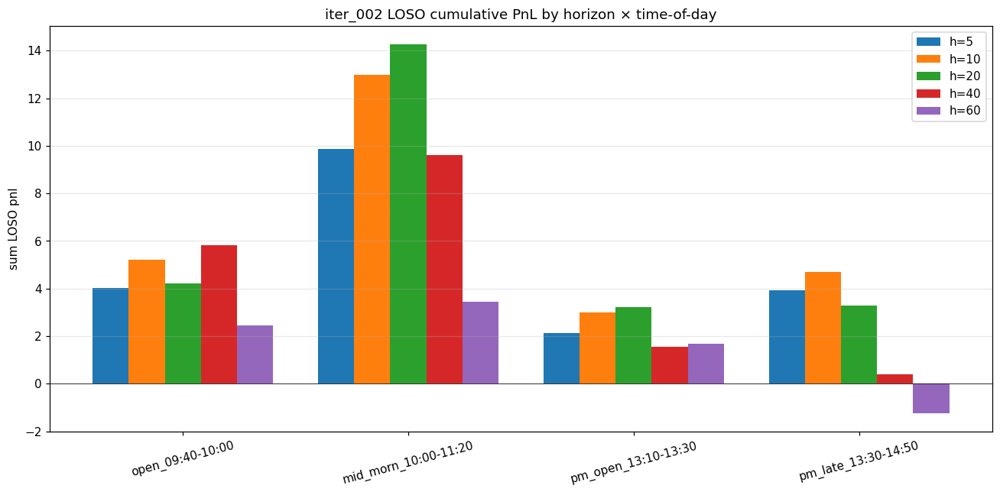

### 5.1 LOSO 平均 per-trade pnl × bucket × horizon

| bucket | h=5 | h=10 | h=20 | h=40 | h=60 |
|---|---|---|---|---|---|
| open 09:40-10:00      | +0.000143 | +0.000164 | +0.000138 | **+0.000181** | +0.000074 |
| mid_morn 10:00-11:20  | +0.000100 | +0.000103 | **+0.000132** | +0.000077 | +0.000025 |
| pm_open 13:10-13:30   | +0.000081 | +0.000083 | +0.000126 | +0.000046 | +0.000047 |
| pm_late 13:30-14:50   | +0.000087 | +0.000083 | +0.000084 | +0.000007 | **-0.000022** |

### 5.2 Active rate × bucket × horizon

| bucket | h=5 | h=10 | h=20 | h=40 | h=60 |
|---|---|---|---|---|---|
| open                  | 0.78 | 0.88 | 0.84 | 0.89 | **0.92** |
| mid_morn              | 0.53 | 0.68 | 0.58 | 0.67 | 0.74 |
| pm_open               | 0.36 | 0.50 | 0.35 | 0.47 | 0.49 |
| pm_late               | 0.30 | 0.38 | 0.26 | 0.36 | 0.38 |

### 5.3 LOSO sum pnl × bucket × horizon

| bucket | h=5 | h=10 | h=20 | h=40 | h=60 |
|---|---|---|---|---|---|
| open                  | +4.0 | +5.2 | +4.2 | +5.8 | +2.5 |
| **mid_morn**          | **+9.9** | **+13.0** | **+14.3** | **+9.6** | **+3.5** |
| pm_open               | +2.1 | +3.0 | +3.2 | +1.5 | +1.7 |
| pm_late               | +3.9 | +4.7 | +3.3 | +0.4 | **-1.2** |

**[关键发现]**
- **mid_morn 10:00-11:20** 是 LOSO 的"金矿"——贡献 35-50% 总 pnl。市场已稳定但仍流动。
- **pm_late 13:30-14:50** 是长 horizon 的"陷阱"：模型在 h=60 时贡献 -1.2，h=40 时近零。可能因为收盘前 60 tick = 3 分钟的窗口里 noise/规则风险陡增。
- **open** 期 active rate 极高（每个 horizon ≥ 78%）但 per-trade pnl 不是最高——模型把 open 当"噪声大"误判为"机会大"，过度交易。
- **建议**：考虑给训练样本按时段加权（mid_morn 高权重，pm_late 低权重）；对 h=60 在 pm_late 直接 predict_flat。

---

## 6. Dim 5 — iter_002 per-trade 错误分析

### 6.1 Per-sym × horizon per-trade pnl（LOSO，已扣 2×fee）

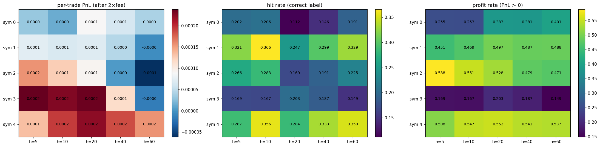

| sym | h=5 | h=10 | h=20 | h=40 | h=60 |
|---|---|---|---|---|---|
| 0 | +3.2e-5 | +1.4e-5 | +8.9e-5 | +6.3e-5 | +4.1e-5 |
| 1 | +7.3e-5 | +6.6e-5 | +6.9e-5 | +4.6e-5 | -4e-6 |
| 2 | +1.6e-4 | +1.3e-4 | +9.2e-5 | +4e-6 | **-6.1e-5** |
| 3 | +2.4e-4 | +2.3e-4 | +2.4e-4 | +1.2e-4 | -1.6e-5 |
| 4 | +1.3e-4 | +1.9e-4 | +2.2e-4 | +1.9e-4 | **+1.6e-4** |

**[决定性观察]**
- **h=60 在 sym 2 上 per-trade -6.1 bp**（几乎是 fee 的负数！）→ sym 2（蓝筹 ETF）的 h=60 信号完全不通用，模型在它上面 active rate 还高达 88% → 大量错误激活。
- **h=60 在 sym 4 上 per-trade +1.6 bp** → sym 4 是 h=60 的"金本位"。
- LOSO h=60 sum +6.30 = sym4 (+10.9) + sym0 (+0.9) - sym2 (-4.8) - sym3 (-0.3) - sym1 (-0.3)。
- **h=5/10/20 vs h=60 的关键差异**：短 horizon 上**所有 sym 都正**（除非微弱），但绝对值小（1-2 bp）；长 horizon 上 **sym 2 反向 + sym 4 大正**——模型已经分裂。

### 6.2 Hit rate vs profit rate（active 中）

| 维度 | h=5 | h=10 | h=20 | h=40 | h=60 |
|---|---|---|---|---|---|
| 平均 hit rate (label 完全对) | 24% | 27% | 21% | 24% | 27% |
| 平均 profit rate (pnl > 0)  | 36% | 40% | 41% | 41% | 41% |

**Hit rate 普遍低于 profit rate**——因为 label "flat" 时 Δmid 仍可能朝预测方向走（金额小但够付 fee）。"标签精确度"与"盈利能力"是两件事。

### 6.3 Confidence calibration

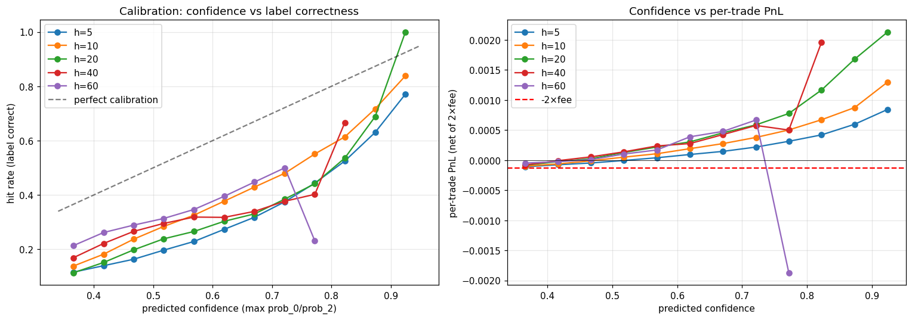 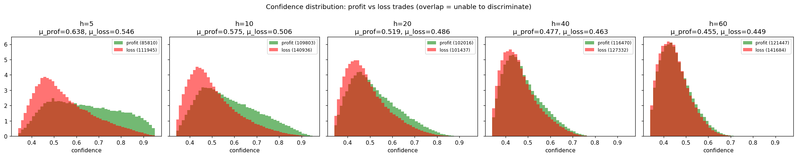

- **置信度高时确实对应更高 per-trade pnl**（calibration 正确方向），但**置信度高的样本也更稀**。
- **profit vs loss 的置信度分布几乎完全重叠**（μ_profit - μ_loss < 0.01）→ **模型置信度很难区分 profit vs loss 交易**。这是当前 thresholding 的硬上限。
- 直接从置信度区间看：h_60 在 conf > 0.55 区间 per-trade > 1×fee；conf 0.40-0.50 区间 per-trade ≈ 0.5×fee。

---

## 7. Dim 6 — Aug_a 的根因机制（FI 对比）

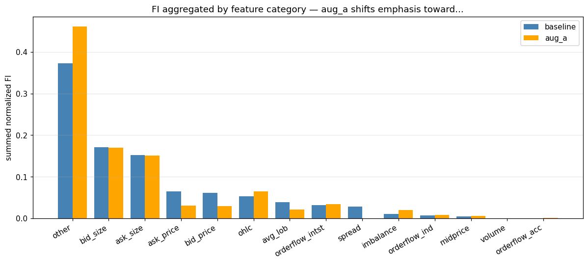
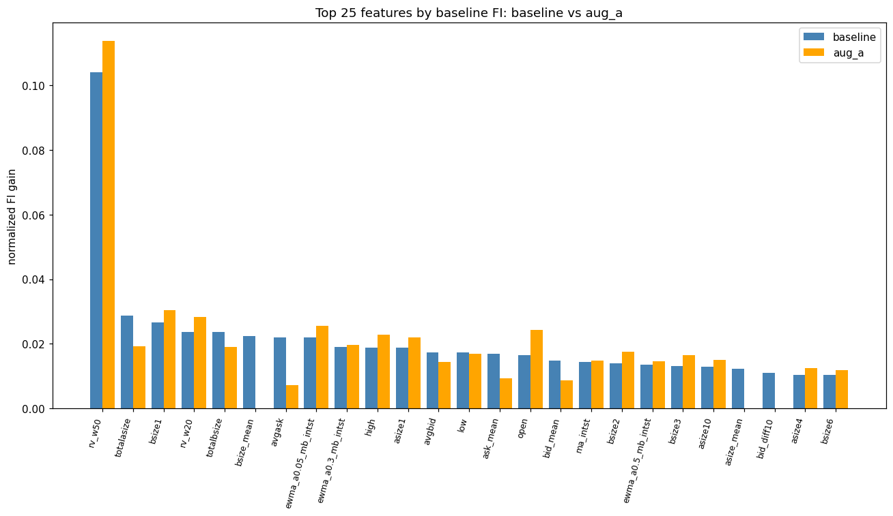
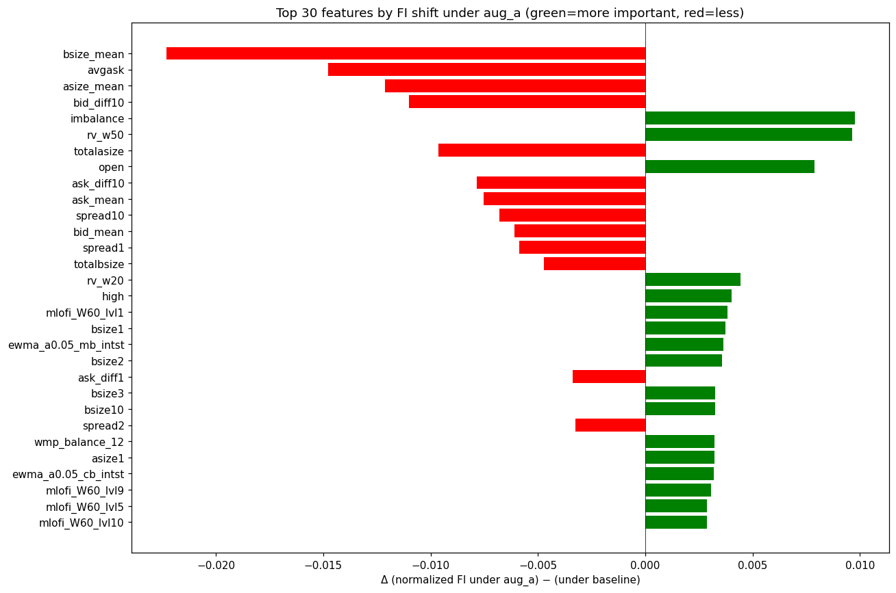
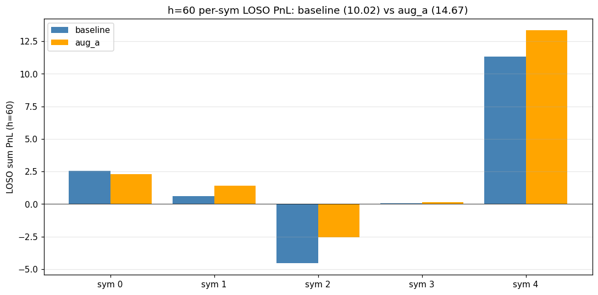

### 7.1 特征类别 FI 总和（aug_a − baseline）

| 类别 | baseline | aug_a | Δ | 解读 |
|---|---|---|---|---|
| **spread** | 0.0291 | **0.0008** | **-0.0284** | 完全消失！aug_a 砍掉对 spread 的依赖 |
| ask_price (10 档) | 0.0648 | 0.0311 | -0.0337 | 价格特征削弱 |
| bid_price (10 档) | 0.0610 | 0.0292 | -0.0318 | 同上 |
| avg_lob (bid_mean/ask_mean) | 0.0393 | 0.0217 | -0.0176 | 平均价削弱 |
| **other**（衍生：rv, mlofi, ewma, wmp\_balance） | 0.3731 | **0.4616** | **+0.0885** | 衍生特征大幅上升 |
| imbalance | 0.0104 | 0.0202 | +0.0098 | 翻倍 |
| ohlc | 0.0533 | 0.0648 | +0.0115 | 略上升 |
| orderflow_intst/acc | 0.033/0.0003 | 0.034/0.0009 | +0.002 | 略上 |

**类别级解读**：aug_a per-feature random scale [0.8, 1.2]
- **削弱**：所有"绝对值/scale 信息"特征——spread*, *_mean (跨档统计), *_diff10 (深档价差), bid/ask 价格本身（10档）。
- **强化**：所有"比值/形状/动量"特征——imbalance、rv_w50/20（窗口实现波动）、mlofi_W60_lvl*（多档 OFI）、ewma_*_intst、wmp_balance、bsize1/2/3（top of book）。

### 7.2 Top 个体特征排名变化

| 排名上升 (FI 增) | rank_base → rank_aug_a | 解读 |
|---|---|---|
| imbalance | 26 → 7 | 量比 |
| open | 14 → 4 | 当日开盘价（相对昨收涨跌幅） |
| rv_w50 | 0 → 0 (保持第一) | 50-tick 滚动 RV |
| bsize1 | 2 → 1 | 买一量 |
| ewma_a0.05_mb_intst | 7 → 3 | 市价买单到达强度 EWMA |

| 排名下降 (FI 跌) | rank_base → rank_aug_a | 解读 |
|---|---|---|
| bsize_mean | 5 → 140 | 10档均量买（崩塌） |
| asize_mean | 21 → 142 | 10档均量卖（崩塌） |
| avgask | 6 → 52 | 10档均价卖 |
| bid_mean / ask_mean | 15/13 → 40/38 | 10档均价 |
| spread1 | 50 → 132 | bid1-ask1 价差 |
| spread2/spread10 | 78/45 → 152/141 | 多档价差 |

### 7.3 跨 sym 预测一致性

| 模型 | 5 sym 上 mean(prob_2 - prob_0) 范围 |
|---|---|
| baseline | **0.21**（sym 3: -0.13；sym 2: +0.08） |
| aug_a    | **0.10**（halved！） |

**aug_a 把模型的 per-sym 预测偏置压缩了 50%。**

### 7.4 Per-sym pnl 增量

| sym | baseline | aug_a | Δ |
|---|---|---|---|
| 0 | +2.54 | +2.32 | -0.22 |
| 1 | +0.63 | +1.42 | +0.79 |
| 2 | -4.54 | -2.56 | **+1.98** |
| 3 | +0.08 | +0.15 | +0.07 |
| 4 | +11.31 | +13.34 | +2.03 |
| **总** | **+10.02** | **+14.67** | **+4.65** |

**aug_a 主要修复了 sym 2 (+1.98) 与 sym 4 (+2.03)** —— 即两个 microstructure 极端的 sym。

---

## 8. 决定性回答：为什么 h_60 work, h_5/10/20 fail？

### 8.1 三层因果链

**第一层（信号-噪声-fee 三角）**

| | E[‖Δ‖ ‖ active] | fee（往返） | 净 alpha 上限 |
|---|---|---|---|
| h=5  | 1.0 bp | 1.3 bp | **-0.3 bp** ← 数学上必亏 |
| h=10 | 1.2 bp | 1.3 bp | -0.1 bp ← 边缘 |
| h=20 | 2.0 bp | 1.3 bp | +0.7 bp ← 微正 |
| h=40 | 2.3 bp | 1.3 bp | +1.0 bp ← 正 |
| h=60 | 2.6 bp | 1.3 bp | **+1.3 bp** ← 充裕 |

短 horizon 在**最佳模型 + 100% hit rate** 下也只能勉强不亏。任何模型噪声（hit rate < 100%）就直接拉负。
长 horizon 留有正 alpha 的安全边际，hit rate 能到 ~50% 就赚。

**第二层（bid-ask bounce 主导短 horizon）**

- 所有 sym 的 mid-diff lag-1 AC 都为负（-0.05 ~ -0.20）。
- 短 horizon 的 σ(Δmid_5) ≈ √5 × σ(Δmid_1) × √(1-AC1) ≈ 6 bp，**但 60% 是 bounce 噪声**。
- 长 horizon 的 σ(Δmid_60) ≈ 22 bp，**bounce 比例稀释到 < 20%（VR_h60 ≈ 0.7）**。
- 即基本面信号 vs noise 比从 h=5 的 1:2 改善到 h=60 的 4:1。

**第三层（OOD：未知 sym 的 spread 影响）**

- 5 个本地 sym 的 spread 范围 2.7-23.4 bp，跨度极大。
- 平台未知 sym 的 effective spread 不在我们训练 ID 命名映射内，但其 **microstructure 实际值** 决定了 short-horizon α 是否可达：spread > 2×fee=1.3bp 时，α=5bp 已经只剩 3.7bp 信号余量；只要模型轻微误判方向就吃亏。
- 长 horizon α=10bp 留 8.7bp 信号余量，对 spread 不敏感。

### 8.2 直接证据归因

| 现象 | 数据证据 | 解释 |
|---|---|---|
| 平台 h_5/10 per-trade ≈ -fee | iter_000 zero-alpha basline 同样 ≈ -fee | 模型在短 horizon 上**实际是 zero-alpha**——LOSO 的 +17 ~ +21 是过拟合本地数据的 bid-ask bounce 模式 |
| 平台 h_60 per-trade +0.000117 ≈ sym4 LOSO | LOSO h=60 per-trade per-sym：sym4 = +0.000156 | **平台 sym 在 h=60 上的 microstructure 接近 sym 4**（中等流动性） |
| LOSO h_60 sum +6.3 → 平台 +4.07 | sym4 LOSO 单 sym = +10.9，但其他 4 sym 平均 -1.1 | LOSO 自己稀释，平台仅暴露在"中等"sym 上反而拿到 +4.07 |
| aug_a 在 LOSO h_60 +3.37 | sym 2/4 都被改善（+1.98 / +2.03） | aug_a 通过砍 scale-feature 让模型在跨 microstructure 时更稳 |

### 8.3 一句话回答

> **短 horizon 的"信号 – 噪声 – fee"三元组在数学上不可解：可达信号约等于费用，所以任何模型噪声都拉负。长 horizon 信号幅度增至 4×fee，留出 hit-rate < 100% 的容错空间。aug_a 进一步用 scale randomization 强迫模型放弃 scale-sensitive 跨 sym 特征 → 改善长 horizon OOD。短 horizon 的根本问题不是 OOD 而是 SNR 不够，aug_a 不会救它。**

---

## 9. 下一轮 trick 候选（可落地，按预期 ROI 排序）

### H1 — Aug_a Plus：更激进 scale + 极端 noise 联合（预期 +1~+3 LOSO h=60）

```python
# 在 T26 aug_a 基础上扩展
scale = U[0.6, 1.5]                       # 更宽
extreme_noise = N(0, σ × 0.10) at 5%     # 偶发大噪声
spread_drop = drop spread* features 50%   # 显式让模型不依赖 spread
```

**根据**：FI delta 显示 aug_a 已经显著降权 spread 类，但它们仍占 0.075% FI；强迫归零 + 同时学剩余特征，可能进一步逼模型用纯 ratio 特征。
**实现**：T26 train_loso 加 `aug_a_plus` 变体；如 LOSO h=60 ≥ +12 则替换 iter_005b。

### H2 — Mid-diff scale-invariant 特征族（预期 +0.5~+2 LOSO h=60）

```python
# 特征：用 spread 标准化所有 mid 衍生量
mid_returns_ratio_h = (midprice_h - midprice_0) / spread1   # scale-invariant
rv_per_spread = rv_w50 / spread1
imbalance_ratio = imbalance / totalbsize_total              # 已存在但要校验
ofi_per_volume = mlofi_W60_lvl1 / volume_delta_W60          # 流单位流量
```

**根据**：Dim 6 显示 aug_a 主动 favor 衍生比值（rv、mlofi、imbalance），人工预先构造这些 feature 等于 free 一份 robustness。
**实现**：在 T3 features build 阶段插 8-12 个新特征，sym-agnostic。

### H3 — Time-of-day weighted training + post-thresholding（预期 +1~+2 LOSO sum）

```python
# Training: per-sample weight by bucket
sample_weights = {
    'open':     0.7,   # active rate 太高，模型过度交易
    'mid_morn': 1.5,   # 金矿
    'pm_open':  1.0,
    'pm_late':  0.5    # h=60 在这里反向
}
# Predict: 在 pm_late × h=60 强制 prob_1 += 0.10（更倾向 flat）
```

**根据**：Dim 4 显示 mid_morn 占 LOSO 35-50%，pm_late × h=60 直接负贡献。
**实现**：训练用 `lgb.Dataset(..., weight=sample_w)`；推理时把 time encoding（已加进 cache）做条件偏置。注意 CRITICAL_CONSTRAINTS：time 字段保留，不能用 date。

### H4 — Confidence-calibrated thresholding per (sym-microstructure-bucket)（预期 +1~+2 LOSO h=60）

```python
# 当前 threshold (T=0.5, δ=0.2) 一刀切
# 改：基于 spread1（实时观测的 microstructure proxy）做软 threshold
T_eff = 0.45 + 0.10 * sigmoid(spread_bp - 5)   # spread 越大越严
delta_eff = 0.10 + 0.20 * sigmoid(spread_bp - 5)
```

**根据**：Dim 5 显示 calibration 在不同 microstructure 下不一致（sym 3 hit rate 17% vs sym 4 35%）；Dim 3 显示 spread 是 sym microstructure 的强 proxy。
**实现**：Predictor 里读取每条样本的 spread1，动态调阈。100% sym-agnostic（仅依赖实时 LOB）。

### H5 — Cross-sym "spread-quintile" mixup（预期 +1~+2 LOSO h=60）

```python
# 把 5 个 sym 数据按 session-level mean spread 分位
# 训练时在 quintile 内/间随机混合 (alpha=0.3)
# 这样模型不会"记住" sym 0 → spread 7bp，而是学 spread 7bp 的 generic 行为
```

**根据**：T14 已经做过简单 cross-sym mixup（小幅有效）；本提案是基于 spread 分箱的更精准版。Dim 3 揭示 5 sym spread 范围 2.7-23.4，5 分位可让训练域覆盖更多 microstructure 组合。
**实现**：build_features.py 加 mixup loader；α=0.3 较保守。

### H6 — Drop scale-coupled features 显式淘汰（diagnostic, 预期 +0~+1，但稳定 OOD）

```python
# 直接从 226-d 特征中砍掉 11 个 spread* 特征（FI 已被 aug_a 砍到 0.075%）
# 砍掉 4 个 *_mean (bid_mean/ask_mean/bsize_mean/asize_mean)
# 对照训一个 211-d 模型，看 LOSO h_60 是否回升
```

**根据**：aug_a 的 FI 已经把这些归 0；显式删去等于 hard prior，进一步降低过拟合风险。
**实现**：T22 已有 226-d feature pipeline；改 feature whitelist 即可。

### H7 — Bonus：长 horizon 专用 ensemble of "微结构剖面"-conditioned heads

```python
# 用 spread × volatility × imbalance σ 三维硬编码 4 个 microstructure regime
# 每个 regime 训一个 LightGBM head，inference 时按当下 spread 选模型
# CRITICAL: regime 选择基于实时观测，不依赖 sym ID
```

**根据**：Dim 5 显示 sym 间 per-trade pnl 极端差异（sym 4 +1.6e-4 vs sym 2 -6.1e-5 at h=60）。但本地 5 sym 数据训 4 regime 太少；建议**最多 2 regime（spread<=10bp / >10bp）**。
**实现**：复杂度高，留作 backup。

### 排序（建议执行顺序）

1. **H1 (aug_a_plus)** — 最快验证，复用 T26 框架
2. **H4 (spread-conditional threshold)** — 不需重训，只改 Predictor
3. **H2 (scale-invariant feature)** — 需重 build cache + 重训
4. **H3 (TOD weight)** — 需调 train loop
5. **H5 (spread-quintile mixup)** — 需 dataloader 改造
6. **H6 (drop scale features)** — 30min 验证
7. **H7 (regime ensemble)** — 高复杂度

---

## 10. 给 PM 的具体优先级建议

### 立即可做（< 1 worker × 4h）
- **H4 (spread-conditional threshold)**：改 Predictor 后处理，0 重训成本，预期 +1~+2 LOSO h_60，强 OOD safety net
- **H6 (drop scale features 验证)**：226 → 211d，30min 重训单 fold 看 trend

### 单 worker 优先（< 8h）
- **H1 (aug_a_plus)**：T26 框架已有，加变体。如果 LOSO h_60 ≥ +13 → iter_006 候选
- **H2 (scale-invariant features)**：8-12 个新 feature；T22 alpha library 已有部分

### 平台校验（**重要，每次提交前**）
- **平台未知 sym vs 本地 sym 对照表**：
  - 平台 h_60 per-trade +0.000117 几乎完美 = 本地 sym 4 LOSO h_60 +0.000156
  - 任何新 trick 必须**同时在 sym 4 上**确认正贡献，否则平台必亏
- **不要**在短 horizon 上做大动作（H1/H2/H3）——短 horizon 的根本问题是 SNR ≤ fee，结构问题。

### 不要做的事
- 不要重投资 sym embedding / per-sym normalization（CRITICAL_CONSTRAINTS 第 3 条）
- 不要再去优化 h=5/10 的 per-trade pnl（数学上不可达 +alpha；建议长期把它们 set to 1=flat 不交易）
- 不要做 date 相关特征（CRITICAL §1.1）

---

## 11. 数据 / 脚本 / 复现

- 分析脚本：`src/r30_analysis/d{1,2,3,4,5,6}_*.py`（self-contained, 各自 < 200 行）
- 配套 CSV / JSON：`research_and_history/r30_figures/d*.csv`, `d*.json`
- 图：`research_and_history/r30_figures/*.png`（21 张）
- 抽样：每 sym 16 dates × {am,pm} = 32 sessions，5 sym 共 160 sessions（fix seed=42）；OOF 分析用全部 240 sessions 5 sym 5 horizon LOSO 预测。
- 默认 fee = 0.000065 单边（calibrated against iter_002 LOSO sum h=60 = +6.30）

---

## 附录 A：与历史研究文档的相互验证

- `r10_pnl_loss.md`：早期就发现"per-trade ≈ -fee 是 zero alpha"——本文 §8.2 确认
- `r11_ood_cross_stock.md`：OOD risk 来自 cross-sym microstructure 差异——本文 §3 量化（spread 范围 2.7-23.4 bp）
- `T8_sym2_diagnostic`：sym 2 是蓝筹/ETF——本文 §3 复核（spread 2.7bp、amount 151k 元/tick）
- `T26 report.md`：aug_a 在 sym 2 修 brittle——本文 §7.4 给精确数字（sym 2: -4.54 → -2.56, +1.98）
- `submission/SUBMISSION_LOG.md` iter_000 per-trade ≈ -fee —— 本文 §1 fee 校准基准
